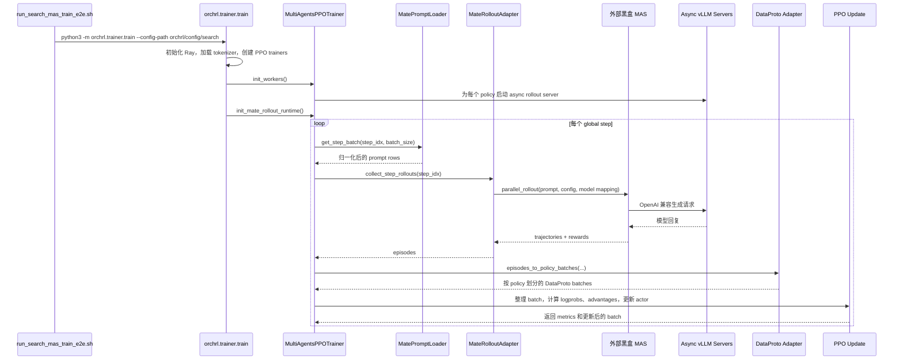
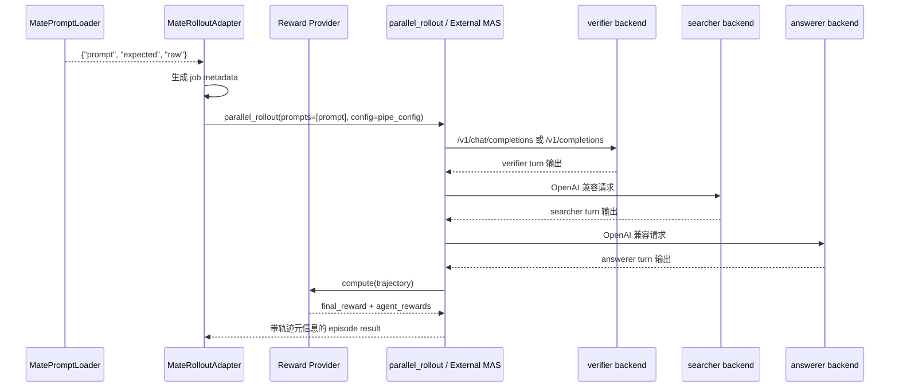

# Search MAS MATE 训练流程

本文档说明当前仓库里已经生效的 Search MAS 端到端训练主流程。

这里只描述当前在用的、基于 MATE 的外部黑盒 MAS 路径，不再覆盖已经清理掉的旧环境分支。

如果你现在关心的是怎么实际启动，而不是链路原理，直接看：

- [Search MAS 运行说明书](training/search-mas-runbook.md)

## 1. 范围与入口

当前最直接的端到端启动脚本是：

- `scripts/run_search_mas_train_e2e.sh`

当前生效的 Hydra 配置是：

- `orchrl/config/search/search_mas_nosearch_external.yaml`
- `orchrl/config/search/search_mas_nosearch_external_5step_4x4_conservative.yaml`

Python 训练入口是：

- `python3 -m orchrl.trainer.train`

当前主运行链路可以概括为：

1. 启动脚本准备环境变量、配置路径和 `PYTHONPATH`
2. `orchrl.trainer.train` 初始化 Ray、tokenizer 和各策略 worker
3. `MultiAgentsPPOTrainer` 为每个 policy 初始化 PPO trainer
4. 每个 PPO trainer 启动本地 async vLLM rollout 服务
5. `MateRolloutAdapter` 读取 prompt，并通过 MATE 拉起外部黑盒 MAS
6. 外部 MAS 在运行时调用本地 OpenAI 兼容的 vLLM 接口
7. MAS 轨迹回传后被转换成 `DataProto`，再进入 PPO 更新

## 2. 主组件

| 组件 | 文件 | 作用 |
| --- | --- | --- |
| 启动脚本 | `scripts/run_search_mas_train_e2e.sh` | 选择配置、设置 `PYTHONPATH`、启动训练 |
| 训练入口 | `orchrl/trainer/train.py` | 初始化 Ray、tokenizer、worker pool 和 `MultiAgentsPPOTrainer` |
| 主训练器 | `orchrl/trainer/multi_agents_ppo_trainer.py` | 驱动 step 循环、rollout 收集、batch 整理和 PPO 更新 |
| Prompt 加载器 | `orchrl/trainer/mate_prompt_loader.py` | 从 parquet/jsonl 加载 prompt，并按 step 切片 |
| MAS rollout 适配层 | `orchrl/trainer/mate_rollout_adapter.py` | 把 prompt 转成 MATE 任务，并发起外部 MAS rollout |
| Reward 桥接层 | `orchrl/trainer/mate_reward_bridge.py` | 按配置动态导入 reward provider |
| Reward 实现 | `orchrl/reward/search/external_mas_reward.py` | 从 MAS 轨迹里计算最终答案 reward |
| Episode 转换层 | `orchrl/trainer/mate_dataproto_adapter.py` | 把 MATE episode 转成按 policy 划分的 `DataProto` |
| Async vLLM 服务 | `orchrl/verl/async_server.py` | 暴露本地 OpenAI 兼容推理接口，供 rollout 调用 |
| PPO 辅助逻辑 | `orchrl/verl/ray_trainer.py` | 处理 KL penalty 和 advantage 计算 |

## 3. 运行期配置是如何接起来的

当前配置中声明了：

- `training.rollout_source: mate`
- `training.mate.roles: [verifier, searcher, answerer]`
- `training.mate.role_policy_mapping`
- `training.mate.prompt_loader`
- `training.mate.mas_command_template`
- `training.mate.config_template_path`
- `training.mate.reward.provider`

`search_mas_nosearch_external.yaml` 里的关键值包括：

- prompt 数据源类型：`parquet`
- prompt 路径：`/data1/zzh/mas_app/search/data/drmas_search_mas/test_sampled.parquet`
- 每个 step 的 batch size：`training.train_batch_size`
- 每个 prompt 采多少条 MAS rollout：`training.train_sample_num`
- 黑盒 MAS 启动命令模板：
  - `python /data1/zzh/mas_app/search/scripts/run_search_mas.py --config {config_path} --question {prompt}`
- reward provider：
  - `orchrl.reward.search.external_mas_reward:compute_reward`

## 4. 数据集是怎么加载的

prompt 加载由 `MatePromptLoader` 负责。

### 4.1 初始化加载

`MatePromptLoader.__init__()` 接收：

- `source_type`
- `path`
- `prompt_keys`
- `expected_keys`

它会在初始化时一次性把整张表载入内存：

- `jsonl` 走逐行 JSON decode
- `parquet` 走 `pandas.read_parquet(...).to_dict(orient="records")`

### 4.2 每个 step 怎么取 batch

`get_step_batch(step_idx, batch_size)` 的切片逻辑是：

```text
start = step_idx * batch_size
rows = all_rows[start : start + batch_size]
```

这意味着当前实现：

- 用的是确定性的连续切片
- `MatePromptLoader` 内部不会重新打乱数据
- step index 就是当前数据游标

每条样本最终会被归一化成：

```python
{
    "prompt": ...,
    "expected": ...,
    "raw": original_row_dict,
}
```

其中：

- `prompt` 来自 `prompt_keys` 里第一个存在的字段
- `expected` 来自 `expected_keys` 里第一个存在的字段

## 5. Prompt 是怎么变成黑盒 MAS 任务的

训练系统到外部 MAS 的桥接点是 `MateRolloutAdapter`。

### 5.1 先构建 MATE 管道配置

`_build_pipe_config()` 会构造 `AgentPipeConfig`，其中包括：

- `mas_command_template`
- 从 YAML 读取的 `config_template`
- 针对每个 MAS role 的 `ModelMappingEntry`
- timeout 与工作目录配置

对每个 role，代码会做三件事：

1. 从 `role_policy_mapping` 读出它映射到哪个 policy
2. 从 `server_address_dict` 里拿到对应本地 rollout 服务地址
3. 从 `policy_server_name_mapping` 里拿到该 policy 对外暴露的 served model 名称

最终生成的 `model_mapping` 决定了黑盒 MAS 在运行时：

- 每个角色该请求哪个 backend URL
- 请求里该填哪个 served model name

### 5.2 Prompt 如何展开成多个 rollout job

对当前 step batch 里的每个 prompt，adapter 会创建：

- 一个 `prompt_group_id`
- `n_samples_per_prompt` 个 rollout job

每个 job 都会带上这些 metadata：

- `prompt`
- `expected`
- `prompt_row`
- `prompt_group_id`
- `sample_idx`

### 5.3 如何真正拉起外部 MAS

每个 job 最终都会调用：

- `mate.trajectory.parallel_rollout(...)`

传入的核心参数包括：

- `prompts=[current_prompt]`
- reward provider wrapper
- 刚刚构建好的 `AgentPipeConfig`
- `VLLMBackend`

因此，外部 MAS 在当前架构里就是一个黑盒：

- OrchRL 自己不执行 search 逻辑
- OrchRL 只负责提供 prompt、运行时配置、角色到模型的映射关系、reward 回调
- 外部 MAS 进程负责真正跑 multi-agent search，并把轨迹返回给 OrchRL

## 6. 外部黑盒 MAS 是怎么接进来的

黑盒连接主要靠三部分。

### 6.1 启动命令模板

`mas_command_template` 指定了 MATE 如何启动外部应用：

```bash
python /data1/zzh/mas_app/search/scripts/run_search_mas.py --config {config_path} --question {prompt}
```

运行时，MATE 会基于 `config_template_path` 生成实际配置文件，把 backend mapping 注入进去，然后启动外部程序。

### 6.2 模型映射

对每个 role，OrchRL 都会传给黑盒 MAS：

- `backend_url`
- `actual_model`

这就是为什么 `verifier`、`searcher`、`answerer` 在需要模型回复时，能知道该访问哪个接口、请求里该填哪个模型名。

### 6.3 Reward 注入

reward provider 会被包装成 `_JobAwareRewardProvider`。

真正计算 reward 之前，它会先把 job 级元信息注入回轨迹：

- prompt 文本
- expected answer
- 原始数据行
- prompt group id
- sample index

后续 reward 函数和 episode-to-batch 适配器都会用到这些信息。

## 7. 模型请求是怎么打到 vLLM 的

每个 PPO trainer 都持有一个 async rollout manager。在 `init_mate_rollout_runtime()` 期间：

1. trainer 读取 `trainer.async_rollout_manager.server_addresses`
2. 把地址存入 `server_address_dict`
3. 通过 `resolve_policy_server_name(...)` 解析出对外 served model 名称

这些地址和别名随后会传到 `MateRolloutAdapter`，再传给 MATE，再进入外部 MAS 配置。

### 7.1 本地服务长什么样

`orchrl/verl/async_server.py` 通过 FastAPI 暴露：

- `/v1/chat/completions`
- `/v1/completions`

接口形态兼容 OpenAI API，下游 MAS 可以直接按 OpenAI 风格请求。

### 7.2 请求调度方式

`async_server.py` 里的 `ChatCompletionScheduler` 会：

- 维护可用 server address 列表
- 按当前 outstanding request 最少的后端做负载均衡
- 用 LRU cache 记录 request id 到 backend 的映射

所以 MAS 侧的请求并不是直接打到 base model，而是经过：

1. 外部 MAS agent 逻辑
2. OpenAI 兼容 HTTP 请求
3. 本地 async vLLM server
4. rollout engine / model worker

### 7.3 请求和响应的边界

对于训练系统来说，关键边界是：

- 模型服务输入：OpenAI 风格的 prompt/messages，加上 served model name
- 模型服务输出：生成出的 token 和 text，再返回给 MAS

MAS 运行时会按 turn 记录：

- chat messages
- response text
- token ids

这些 turn 级记录最后会作为 trajectory data 回到 OrchRL。

## 8. 时序图：一次完整训练 step



## 9. 时序图：单个 prompt 如何完成一次 MAS rollout



## 10. Episode 是怎么变成训练 batch 的

`episodes_to_policy_batches(...)` 会把 MATE episode 转成每个 policy 一份 `DataProto`。

### 10.1 turn 级样本是怎么构造的

对每个 episode，代码会：

1. 遍历每个 role 的 trajectory
2. 遍历该 role 的每个 turn
3. 用 `tokenizer.apply_chat_template(...)` 把 prompt messages tokenize
4. 取 `turn.token_ids` 作为返回响应 token
5. 按 `credit_assignment` 给这一条 turn 分配 reward

当前配置中的 `credit_assignment` 是：

- `all_turns`

所以当前的最终标量 reward 会被复制到该 role 的每一个 turn 上。

每条记录里会带这些字段：

- `prompt_ids`
- `response_ids`
- `response_mask`
- `agent_name`
- `agent_idx`
- `turn_idx`
- `env_idx`
- `episode_id`
- `prompt_group_id`
- `sample_idx`
- `reward`
- `uid`

### 10.2 当前的 UID 分组方式

当前 `uid` 形式是：

```text
{prompt_group_id}:{agent_idx}
```

这意味着当前 GRPO 分组是在 “同一个 prompt group + 同一个 role” 这个粒度上做的，而不是按 turn 粒度做。

### 10.3 DataProto 里具体有什么

每个 policy batch 都会包含：

- `prompts`
- `responses`
- `response_mask`

以及上面那些 bookkeeping 用的 non-tensor metadata。

这里有两个关键点：

- `prompts` 是 token id
- `responses` 是 token id

也就是说，到了训练更新阶段，已经不是原始文本字符串了。

## 11. PPO 更新前，batch 还会做什么整理

在 `_update_parameters(...)` 里，trainer 会把 PPO 所需的最终张量补齐。

### 11.1 张量构造

trainer 会构建：

- `prompts`
- `responses`
- `input_ids = concat(prompts, responses)`
- `attention_mask`
- `position_ids`
- `response_mask`

### 11.2 token 级 reward 是怎么放进去的

代码会创建一个与 `responses` 同形状的稠密 `reward_tensor`。

每条样本的标量 reward 只会放在最后一个有效 response token 上：

- 前面的 response token reward 都是 `0`
- 最后一个有效 response token 才放标量 reward

然后：

- `token_level_scores = reward_tensor`
- `token_level_rewards = token_level_scores`

因此，原始 outcome-level 的单个 reward 会被转换成与 token 对齐的训练信号。

## 12. Reward 是怎么计算的

当前启用的 reward 实现是 `orchrl.reward.search.external_mas_reward:compute_reward`。

其逻辑是：

1. 读取 `answerer` 的 trajectory
2. 取最后一条 answerer 回复
3. 如果有 `<answer>...</answer>`，就抽出其中内容；否则直接用最终文本
4. 对预测文本和 expected answer 做归一化
5. 返回：
   - 命中则 `final_reward = 1.0`
   - 否则 `final_reward = 0.0`
6. 把同样的最终 reward 复制给每个 role 的 `agent_rewards`

由于当前配置启用了 `credit_assignment: all_turns`，所以这个 role 级 reward 在 batch 构建时又会进一步广播到该 role 的所有 turn。

## 13. Loss 相关量是在什么地方算出来的

batch 整理完成后，trainer 会继续补齐 PPO 所需字段。

### 13.1 旧策略 log prob

`ppo_trainer.actor_rollout_wg.compute_log_prob(batch)` 会重新计算：

- `old_log_probs`

并把结果合并回 batch。

### 13.2 参考策略 log prob

如果启用了 reference policy 或者 reward 内 KL，则还会计算：

- `ref_log_prob`

### 13.3 KL penalty

如果启用了 `algorithm.use_kl_in_reward`，`apply_kl_penalty(...)` 会基于以下字段修正 token-level reward：

- `old_log_probs`
- `ref_log_prob`

### 13.4 Advantage 与 Return

`compute_advantage(...)` 会写入：

- `advantages`
- `returns`

在 GRPO 模式下，分组依据是：

- `data.non_tensor_batch["uid"]`

### 13.5 Actor 更新

最后：

- `ppo_trainer.actor_rollout_wg.update_actor(batch)`

会基于已经包含 rollout token、mask、reward、old logprobs 和 advantages 的 batch 执行 actor 前向、反向和参数更新。

## 14. 当前训练 batch 里的关键字段

| 字段 | 含义 | 来源 |
| --- | --- | --- |
| `prompts` | 左侧 padding 的 prompt token ids | 由 prompt messages 经过 chat template tokenize 得到 |
| `responses` | 右侧 padding 的 response token ids | 来自 MAS trajectory 里的 `turn.token_ids` |
| `response_mask` | response 有效 token mask | 由 response ids 构建 |
| `input_ids` | 拼接后的 prompt + response token ids | 在 `_update_parameters()` 中构建 |
| `attention_mask` | 整段序列的有效 token mask | 在 `_update_parameters()` 中构建 |
| `position_ids` | 自回归位置编码 | 在 `_update_parameters()` 中构建 |
| `token_level_scores` | 稀疏 reward tensor | 标量 reward 只放在最后一个有效 response token |
| `token_level_rewards` | advantage 计算实际使用的 reward tensor | 直接拷贝自 `token_level_scores` |
| `old_log_probs` | rollout 策略下的 log prob | 由 actor rollout worker 重新计算 |
| `ref_log_prob` | reference policy 的 log prob | 开启时计算 |
| `advantages` | PPO advantage | 由 `compute_advantage()` 计算 |
| `returns` | PPO return target | 由 `compute_advantage()` 计算 |
| `uid` | GRPO 分组 key | 当前格式为 `{prompt_group_id}:{agent_idx}` |

## 15. 验证集路径

当前验证流程已经对齐到同一条 MATE rollout 路径上，不再走单独的旧环境分支。

验证阶段，trainer 会：

1. 使用同一套 prompt loader / rollout adapter 边界
2. 为验证 prompt 收集 MATE episodes
3. 从返回 episode outcome 中汇总验证指标，例如 success rate

这意味着训练和验证现在已经在 rollout 接口层面对齐：

- 同一个黑盒 MAS 集成边界
- 同一套 role-to-policy mapping
- 同一套 reward 解释方式

## 16. 基于真实运行结果的当前观察

根据最近一次 `scripts/run_search_mas_train_e2e.sh` 的 E2E 实跑结果：

- 整个训练主循环已经可以端到端跑通
- PPO update 阶段确实执行了
- step 也能正常推进

但当前 reward 信号仍然基本为零：

- 日志里的 `mean_reward` 为 `0.0`
- 记录到的 reward、advantage 和 return 基本都是 `0.000`

所以当前链路的结论不是“流程没接通”，而是“流程已经接通，但 reward 路径暂时还没有产出有效学习信号”。

## 17. 实际上当前系统是什么结构

当前系统已经不是仓库内自带的 multi-agent environment 训练结构了。

现在的主架构是一个分层编排栈：

1. OrchRL 负责分布式 PPO 训练和本地 vLLM rollout 服务
2. MATE 负责把 prompt 桥接到外部黑盒 MAS 工作流
3. 外部 MAS 再反向调用 OrchRL 暴露出来的 OpenAI 兼容模型服务
4. 返回轨迹被转换成 token 级 PPO 训练 batch
5. 每个 policy 基于这些 token 化轨迹执行 PPO 更新

这就是当前仓库里真实生效的训练架构。
